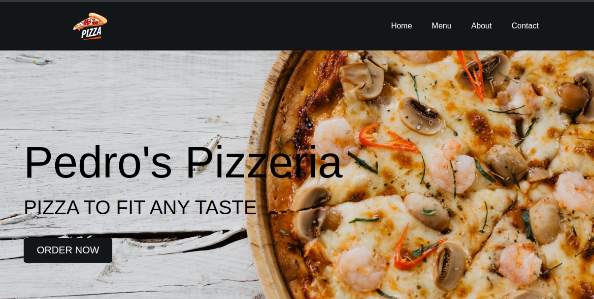
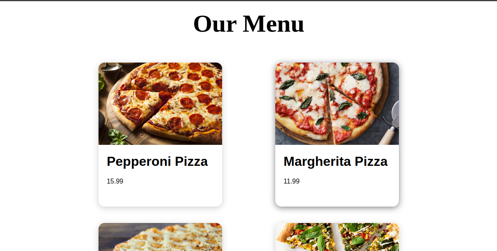
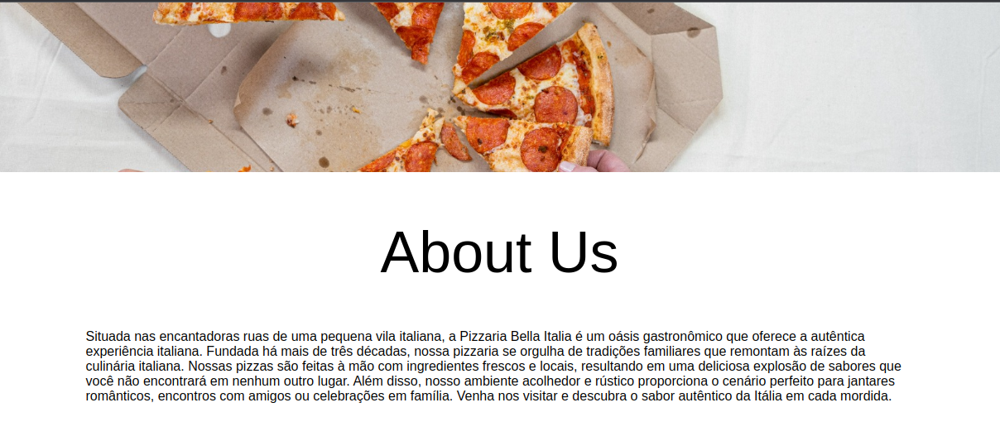
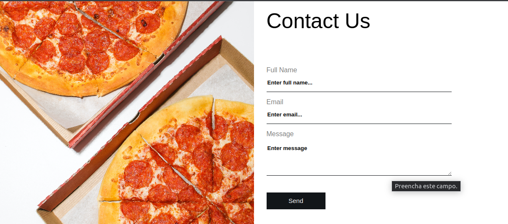

<h1 align="center">React Pizzeria Website</h1>

  

# React Pizzaria 🍕🍴

Bem-vindo à React Pizzaria, onde a magia do React encontra o sabor inigualável das melhores pizzas! Este projeto é uma plataforma digital para pedidos online e exploração do universo de sabores de pizza.

## Sobre o Projeto 🏢🍽️

A React Pizzaria é um projeto desenvolvido com React, visando proporcionar uma experiência interativa para os amantes de pizza. Com um design intuitivo e uma interface elegante, permitimos que os clientes explorem nosso menu e façam pedidos de forma simples e rápida.

## Funcionalidades 🌟⚙️

- **Menu Interativo:** Explore uma ampla variedade de pizzas com detalhes sobre ingredientes e tamanhos disponíveis.

## Como Executar o Projeto 🚀🔧

1. **Clone o Repositório:** `https://github.com/tiagoskaterock/react-pizzeria-website`
2. **Instale as Dependências:** `npm install` ou `yarn install`
3. **Inicie o Servidor de Desenvolvimento:** `npm start` ou `yarn start`
4. **Acesse no Navegador:** Abra `http://localhost:3000` para visualizar a aplicação.

## Estrutura do Projeto 📁🖥️

/  
|-- /public  
| |---- /index.html        
|-- /src  
| |---- /assets        
| |---- /components    
| |---- /helpers       
| |---- /pages         
| |---- /styles   
| |---- /index.js        
|-- ...  

## Tecnologias Utilizadas 🛠️💻

- **React:** Biblioteca JavaScript para construção de interfaces de usuário.
- **React Router:** Gerenciamento de rotas na aplicação.
- **Styled Components:** Estilização dos componentes utilizando CSS-in-JS.

## Contribuições e Problemas 🤝❗

Contribuições são sempre bem-vindas! Se encontrou algum problema ou deseja adicionar uma nova funcionalidade, sinta-se à vontade para abrir uma issue ou enviar um pull request.

## Aproveite sua Pizza! 🍕😋

A React Pizzaria foi criada para trazer a alegria de uma boa pizza para o mundo digital. Aproveite sua experiência de pedir pizzas deliciosas de forma prática e saborosa!

  
  
  
  
  

